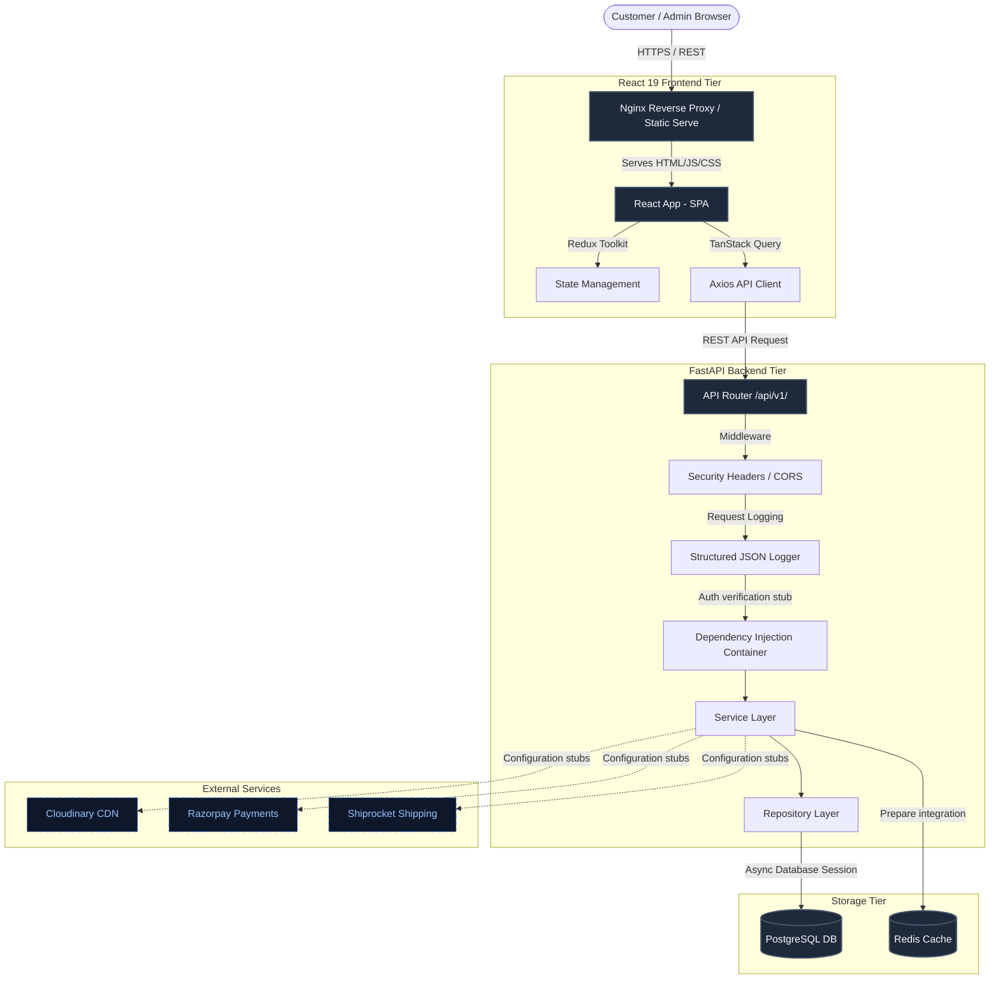
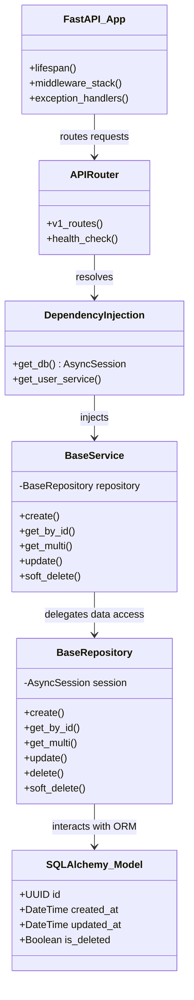
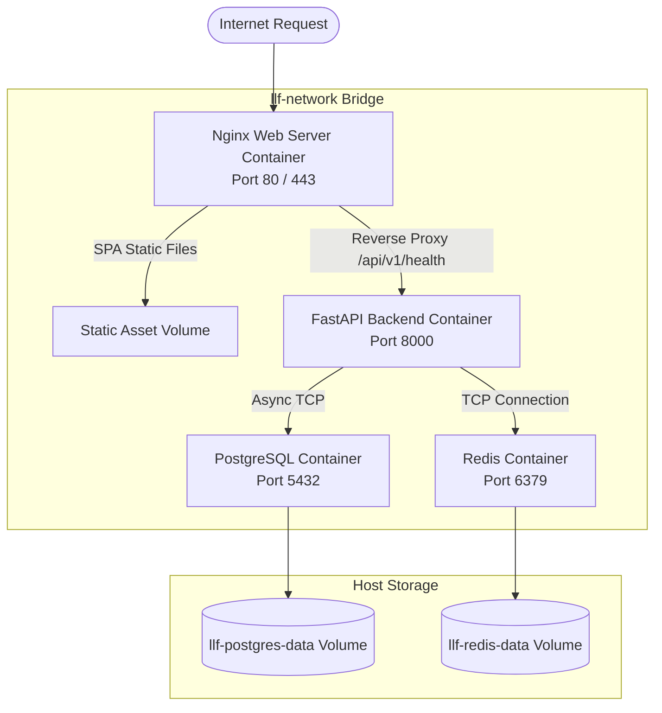
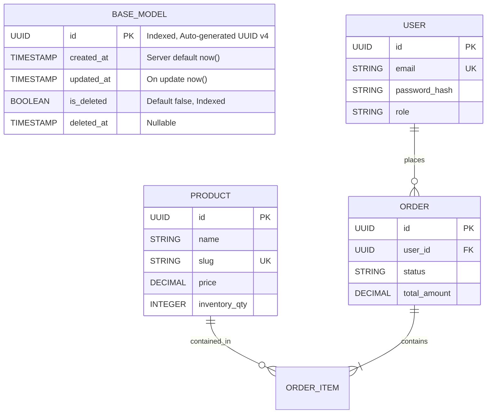

# System Architecture & Enterprise Design

This document details the system design, components, and deployment architecture for **Love Ludhiana Fashion**.

---

## 1. System Architecture Diagram

The platform utilizes a decoupled, three-tier architecture ensuring complete separation of concerns between the React user interface, the FastAPI service layers, and the PostgreSQL storage systems.

---

## 2. Component Diagram (FastAPI Backend)

The backend follows the **Domain-Driven Repository & Service Layer Pattern** for optimal modularity and testability.

---

## 3. Deployment Diagram (Docker Containers)

Containerized environments ensure parity between local development and cloud production.

---

## 4. Database Architecture Diagram

The base model schema design enforces standard attributes across all enterprise tables.

